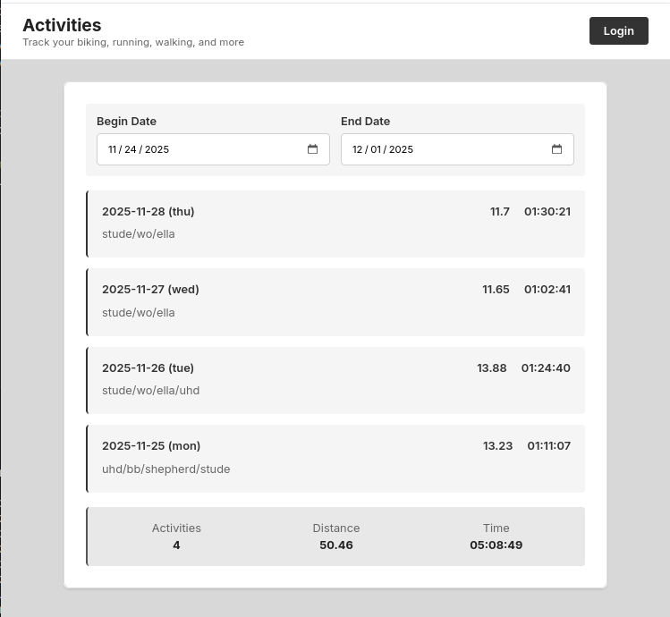
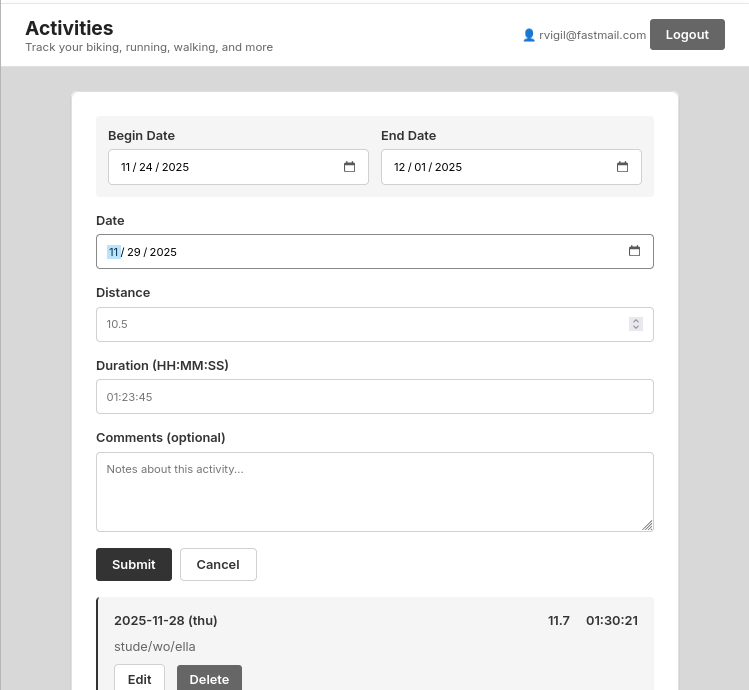
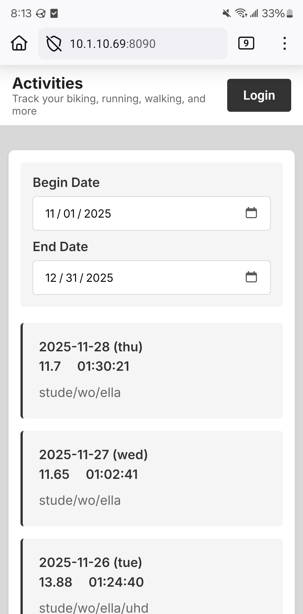

# PocketBase Activity Tracker

A minimalist activity tracking web application built on PocketBase for logging distance-based exercises like biking, running, walking, and more.



## Features

- **Date Range Filtering** - Always-active date range that persists across sessions (defaults to current week)
- **Comments Search** - Filter activities by comment text with multi-word AND matching (e.g., "rainy yale" finds activities containing both words)
- **Smart Display** - Shows individual activities (≤31) or totals only (>31) to handle large date ranges efficiently
- **Real-time Updates** - Live synchronization when activities are added, edited, or deleted
- **Public & Private Views** - Public read-only access for all users, authenticated CRUD for logged-in users
- **Responsive Design** - Works seamlessly on desktop and mobile devices
- **Clean Monochrome UI** - Simple, distraction-free interface

## Screenshots

### Desktop Interface



### Mobile Interface




## Live Demo

Visit [robertvigil.com/activities](https://robertvigil.com/activities) to see it in action.

**Test Account:**
- Email: `test@example.com`
- Password: `password123`

*Note: Test account data older than 24 hours is automatically deleted when the test user logs in.*

## Quick Start

### 1. Download PocketBase

```bash
curl -L https://github.com/pocketbase/pocketbase/releases/download/v0.23.7/pocketbase_0.23.7_linux_amd64.zip -o pocketbase.zip
unzip pocketbase.zip
rm pocketbase.zip
chmod +x pocketbase
```

### 2. Start PocketBase

**For local access only:**
```bash
./pocketbase serve
```

**For network access (phone, other devices):**
```bash
./pocketbase serve --http="0.0.0.0:8090"
```

Find your IP: `hostname -I` or `ip addr show`

### 3. Initial Setup

1. Visit `http://127.0.0.1:8090/_/` (or `http://YOUR_IP:8090/_/`)
2. Create an admin account
3. Create the `activities` collection (see Database Schema below)
4. Create a user account in the Users collection
5. Visit `http://127.0.0.1:8090/` to access the app

## Database Schema

### Activities Collection

**Collection Settings:**
- Name: `activities`
- Type: Base collection

**Fields:**

| Field | Type | Required | Settings |
|-------|------|----------|----------|
| `date` | Date | Yes | ISO 8601 format (YYYY-MM-DD) |
| `distance` | Number | Yes | Min: 0, Decimal (e.g., 10.5) - can be miles, kilometers, etc. |
| `duration` | Text | Yes | Format: HH:MM:SS, Pattern: `^([0-9]{2}):([0-5][0-9]):([0-5][0-9])$` |
| `comments` | Text | No | Max length: 500 (optional notes) |
| `user` | Relation | Yes | Single relation to `users` collection |

**API Rules:**

| Action | Rule | Description |
|--------|------|-------------|
| List/Search | *(empty)* | Public read access for all activities |
| View | *(empty)* | Public read access for individual activities |
| Create | `@request.auth.id != ""` | Only authenticated users can create |
| Update | `user = @request.auth.id` | Users can only update their own activities |
| Delete | `user = @request.auth.id` | Users can only delete their own activities |

**Note:** Leaving List/Search and View rules empty allows public viewing while maintaining authentication requirements for create/update/delete operations.

## How It Works

### Authentication
- Uses PocketBase's built-in JWT authentication
- Token stored in browser localStorage
- Automatically included in all API requests

### Date Range & Display Logic
- **Default range:** Current week (Monday to Sunday)
- **Persistence:** Date range saved to localStorage
- **Smart display:**
  - ≤31 activities: Shows full list with details + totals
  - >31 activities: Shows count message + totals only
- **Rationale:** Prevents UI overload when querying large date ranges (e.g., "all time")

### Comments Search
- Case-insensitive wildcard matching on comments field
- **Multi-word AND search:** Enter multiple words separated by spaces to find activities containing ALL words
  - Example: "rainy yale" matches "took a rainy ride on yale street" and "rode down yale, it was rainy"
- Search updates instantly as you type

### Public vs. Authenticated Views

**When Logged Out:**
- View all users' activities (read-only)
- See date range controls and totals
- No Create/Edit/Delete buttons
- "Login" button in header

**When Logged In:**
- View all users' activities
- Create new activities
- Edit/Delete only your own activities
- User email displayed in header

### Real-time Updates
- PocketBase websocket subscription keeps data in sync
- Automatically refreshes when activities change
- Works across multiple devices/sessions

## Network Access

To access from your phone or other devices on the same network:

1. Start PocketBase with network binding:
   ```bash
   ./pocketbase serve --http="0.0.0.0:8090"
   ```

2. Find your computer's IP address:
   ```bash
   hostname -I
   ```

3. Access from other devices:
   ```
   http://YOUR_IP:8090/
   ```

4. Ensure your firewall allows connections on port 8090

## Data Import

If you have existing activity data in tab-delimited format (date, distance, duration, comments), you can bulk import using the PocketBase API.

**Example tab file format:**
```
2023-01-03	10.09	00:55:27	morning ride
2023-01-05	15.14	01:16:00	commute
```

See the PocketBase API documentation for bulk import methods.

## Technology Stack

- **Backend:** PocketBase v0.23.7 (Go-based, SQLite database)
- **Frontend:** Vanilla HTML/CSS/JavaScript
- **UI Framework:** None (custom CSS)
- **Font:** Inter (Google Fonts)
- **Architecture:** Single-page application (SPA)

## Project Structure

```
pocketbase-activities/
├── pocketbase             # PocketBase executable
├── pb_data/               # Database and files (auto-created, git-ignored)
├── pb_public/             # Frontend files (served by PocketBase)
│   └── index.html         # Main application
├── screenshots/           # Screenshots for documentation
│   ├── desktop-main.png
│   ├── desktop-create.png
│   ├── mobile-main.png
│   ├── mobile-totals.png
├── README.md              # This file
└── .gitignore             # Git ignore rules
```

## Design Principles

- **Simplicity:** No build process, no dependencies, just HTML/CSS/JS
- **Consistency:** Single `1rem` font size throughout for all content
- **Minimalism:** Monochrome color scheme, clean UI
- **Privacy:** User emails not displayed publicly, only activity data
- **Performance:** Client-side calculations, efficient data fetching

## Browser Compatibility

Works on all modern browsers that support:
- ES6 JavaScript
- LocalStorage API
- Fetch API
- CSS Grid & Flexbox

## License

MIT

## Credits

Built with [PocketBase](https://pocketbase.io/) - an open-source backend in a single file.
